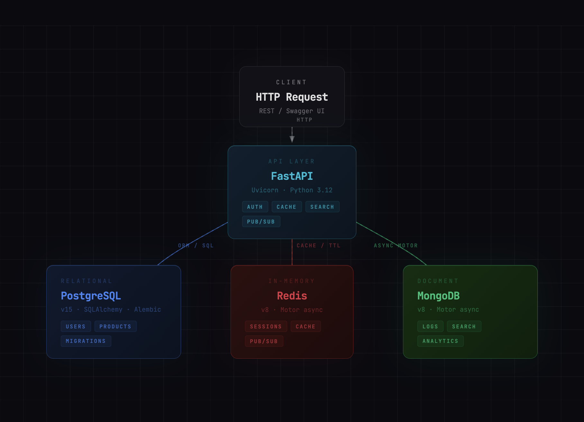

FastAPI-MultiDB-PostgreSQL-Redis-MongoDB-Stack

A multi-database backend API built with FastAPI, demonstrating how PostgreSQL, Redis, and MongoDB can work together in a single application. Each database is used for what it does best: PostgreSQL handles persistent relational data, Redis manages sessions and caching, MongoDB stores request logs and powers full-text search.


## Architecture





---

## Tech Stack

| Layer | Technology |
|---|---|
| API Framework | FastAPI + Uvicorn |
| Relational DB | PostgreSQL 15 + SQLAlchemy ORM |
| Cache / Messaging | Redis 8 |
| Document DB | MongoDB 8 + Motor (async) |
| DB Migrations | Alembic |
| Containerization | Docker + Docker Compose |

---

## Installation (Mac)

### 1. Install databases

```bash
# Redis
brew install redis
brew services start redis
redis-cli ping  # PONG

# MongoDB
brew tap mongodb/brew
brew install mongodb-community
brew services start mongodb/brew/mongodb-community

# PostgreSQL
brew services start postgresql@14
```

### 2. Create PostgreSQL database

```bash
createdb multidb_demo
```

### 3. Install Python dependencies

```bash
python3 -m venv venv
source venv/bin/activate
pip install fastapi uvicorn sqlalchemy psycopg2-binary redis motor python-dotenv alembic
```

### 4. Create .env file

```bash
cat > .env << 'EOF'
POSTGRES_URL=postgresql://yourusername@localhost:5432/multidb_demo
REDIS_URL=redis://localhost:6379
MONGO_URL=mongodb://127.0.0.1:27017
EOF
```

### 5. Run

```bash
uvicorn main:app --reload
```

Swagger UI: http://localhost:8000/docs

---

## Docker Compose (all services)

```bash
docker compose up --build
```

API: http://localhost:8001/docs

Services:
- PostgreSQL → port 5433
- Redis → port 6380
- MongoDB → port 27018
- FastAPI → port 8001

---

## API Endpoints

### Auth (PostgreSQL + Redis)

```bash
# Register
curl -X POST http://localhost:8000/register \
  -H "Content-Type: application/json" \
  -d '{"username":"kemal","password":"123"}'

# Login — creates Redis session (TTL 1h)
curl -X POST http://localhost:8000/login \
  -H "Content-Type: application/json" \
  -d '{"username":"kemal","password":"123"}'

# Check session
curl http://localhost:8000/session/kemal
```

### Products (PostgreSQL + Redis cache)

```bash
# Add product
curl -X POST http://localhost:8000/products \
  -H "Content-Type: application/json" \
  -d '{"name":"Laptop","price":"999"}'

# Get products (1st request: PostgreSQL, 2nd: Redis cache)
curl http://localhost:8000/products
```

### Search (MongoDB full-text)

```bash
curl "http://localhost:8000/search?q=laptop"
```

### Notifications (Redis Pub/Sub)

```bash
# Listen (3 second window) — run in background
curl "http://localhost:8000/listen" &

# Publish
curl -X POST "http://localhost:8000/notify?message=New+product+added"
```

### Observability

```bash
# Health check — all 3 DBs
curl http://localhost:8000/health
# {"postgresql":"ok","redis":"ok","mongodb":"ok"}

# Last 10 request logs (MongoDB)
curl http://localhost:8000/logs
```

---

## Redis — Key Patterns

### CLI / RedisInsight

```bash
# String with TTL
SET session:kemal "active" EX 3600
TTL session:kemal
GET session:kemal

# Rate limiting counter
INCR ratelimit:kemal
EXPIRE ratelimit:kemal 60

# List (recent products)
LPUSH recent:kemal "laptop" "phone" "tablet"
LRANGE recent:kemal 0 -1
LLEN recent:kemal
RPOP recent:kemal
```

### Cache hit/miss flow

```
GET /products (1st request)
  → Redis: products:all key not found
  → PostgreSQL: SELECT * FROM products
  → Redis: SET products:all (TTL 60s)
  → Response: {"source": "PostgreSQL"}

GET /products (2nd request)
  → Redis: products:all key found
  → Response: {"source": "Redis cache"}
```

---

## MongoDB — Operations

### mongosh

```javascript
use multidb_demo

// Insert
db.products.insertOne({ name: "Laptop", price: 999, stock: 10 })
db.products.insertMany([
  { name: "Gaming Laptop", description: "High performance laptop for gaming" },
  { name: "Office Chair", description: "Ergonomic chair for office use" },
  { name: "Mechanical Keyboard", description: "Laptop compatible mechanical keyboard" }
])

// Find
db.products.find()
db.products.findOne({ name: "Laptop" })

// Update
db.products.updateOne({ name: "Laptop" }, { $set: { price: 899 } })

// Delete
db.products.deleteOne({ name: "Tablet" })

// Aggregation — total stock and average price
db.products.aggregate([
  { $group: { _id: null, totalStock: { $sum: "$stock" }, avgPrice: { $avg: "$price" } } }
])

// Sort by price descending
db.products.aggregate([{ $sort: { price: -1 } }])

// Filter price > 200
db.products.aggregate([{ $match: { price: { $gt: 200 } } }])
```

---

## Alembic Migrations

```bash
# Initialize
alembic init migrations

# Configure alembic.ini — set DB URL
# sqlalchemy.url = postgresql://user@localhost:5432/multidb_demo

# Configure migrations/env.py — import models
# from main import Base
# target_metadata = Base.metadata

# Create and apply initial migration
alembic revision --autogenerate -m "initial tables"
alembic upgrade head

# After adding a column to model (e.g. email field to UserModel)
alembic revision --autogenerate -m "add email to users"
alembic upgrade head

# Rollback one step
alembic downgrade -1
```

---

## Database Design Decisions

| Data | Database | Reason |
|---|---|---|
| Users, Products | PostgreSQL | Relational, permanent, critical |
| Sessions, Cache | Redis | RAM-based, fast, TTL support |
| Request Logs | MongoDB | Schema-free, append-only |
| Full-text Search | MongoDB | Native text index |
| Pub/Sub | Redis | Built-in channel messaging |

---

## Project Structure

```
multi-db-fastapi/
├── main.py
├── requirements.txt
├── Dockerfile
├── docker-compose.yml
├── .env
└── migrations/
    ├── env.py
    ├── script.py.mako
    └── versions/
        ├── 05c7b87a1a68_initial_tables.py
        └── 62f19762b8f9_add_email_to_users.py
```


📄 License This project is licensed under the MIT License.
